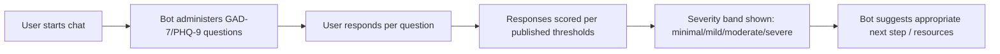

# Mental Health Screening Chatbot

## Problem Statement

Early screening for anxiety and depression relies on standardized clinical questionnaires (GAD-7 for anxiety, PHQ-9 for depression), but these are often administered on paper or static web forms with no conversational guidance. This project explores whether a conversational interface, backed by an LLM (Gemini API), can administer these screening tools in a more approachable way while still scoring them exactly as the clinical frameworks specify.

**Requirements gathered from the source frameworks:**
| Requirement | Source | How it's addressed |
|---|---|---|
| Exact question set and wording per framework | GAD-7 / PHQ-9 are standardized instruments — wording can't be altered | Chatbot presents the official question sets verbatim |
| Correct scoring bands (e.g. minimal / mild / moderate / severe) | Clinical validity depends on using the published scoring thresholds | Scoring logic follows GAD-7/PHQ-9 published cutoffs |
| Conversational, non-clinical tone | Reduce friction/anxiety about the screening itself | Gemini API used to frame questions conversationally without changing their clinical content |

**Important scope note:** this is a screening-support tool, not a diagnostic one — it estimates severity bands from validated questionnaires, it does not replace clinical assessment. This distinction matters both ethically and as a requirement constraint on the system.

## Process Flow

## Tech Stack
- Python, Google Colab / Jupyter Notebook
- Gemini API (conversational layer)
- NLP for response handling

## Topics
`python` `nlp` `chatbot` `mental-health` `gemini-api` `gad7` `phq-9`

## Disclaimer
This tool is for educational/screening-support purposes only and is not a substitute for professional diagnosis. Anyone using it who is experiencing significant distress should consult a qualified mental health professional.
