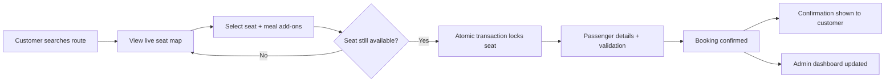

# Sleeper Bus Ticket Booking System 🚌

A premium Django-based booking platform for intercity sleeper bus travel, featuring real-time seat selection, meal integration, and AI-powered booking predictions.

## Problem Statement & Requirements

Sleeper bus operators and small travel agencies commonly rely on manual seat charts and phone-based bookings, which leads to double-booking, no traceability for disputes, and no visibility into occupancy for admins. YatraConnect was built to digitize this process end-to-end.

**Stakeholders identified:**
- **Customers** — need to see live seat availability, select a specific berth, add meal preferences, and get a verifiable ticket.
- **Bus operators / admins** — need to manage routes, buses, and seat inventory, and see booking activity without conflicts.

**Functional requirements gathered:**
| Requirement | Why it matters | How it's addressed |
|---|---|---|
| Prevent double-booking under concurrent access | Two users selecting the same seat at once is the #1 failure mode of naive booking systems | Atomic DB transactions + row locking during booking |
| Traceable booking reference | Needed for customer support and dispute resolution | Unique booking record per confirmed transaction |
| Role-based access | Admin actions must be separated from customer actions | Django REST Framework ViewSets with role separation |
| Visual seat selection | Customers need to pick a specific seat, not just "any seat" | Interactive Lower (L1–L15) / Upper (U1–U15) deck seat map |
| Predictive insight for admins | Operators want to anticipate demand | Mock AI "Confirmation Probability %" based on user intent signals |

**Success criteria:** no double-bookings under simulated concurrent requests, invalid input (bad phone numbers, invalid names) rejected at the API level, and seat status always consistent with booking records.

## Process Flow



## ✨ Defined Features

1. **Backend API Implementation**: Robust RESTful API using **Django REST Framework** with `ViewSets` and `Routers`.
2. **Visual Seat Selection**: Interactive map distinguishing Lower (L1-L15) vs. Upper (U1-U15) deck sleeper seats.
3. **Smart Prediction Logic**: Mock AI algorithm calculating a "Confirmation Probability %" based on user intent signals (meal choice, group size).
4. **Concurrency Handling**: Prevents double-booking using Atomic Transactions and Row Locking.
5. **Integrated Add-ons**: Seamless meal booking (Veg/Snack) affecting total fare calculation.

## 🧪 Test Cases

### Functional Tests
- [x] **Seat Booking Flow**: User selects seat -> Fills Passenger Details -> Booking Creation Success.
- [x] **API Validation**: Rejects invalid phone numbers (non-10 digits) and names (special characters).
- [x] **Race Condition Check**: Concurrent requests for the same seat results in one success and one failure.

### Edge Cases
- [x] **Zero Availability**: System gracefully handles full bus scenario.
- [x] **Data Integrity**: Checks ensuring Seat status updates strictly match Booking records.

## 🛠️ Setup Instructions

1. **Clone the Repository**:
```
git clone <repository-url>
cd sleeper_bus_project
```

2. **Install Dependencies**:
```
pip install django djangorestframework
```

3. **Initialize Database**:
```
python manage.py migrate
python manage.py shell -c "import populate_db; populate_db.run()"
```

4. **Run Application**:
```
python manage.py runserver
```

## Skills Demonstrated
Requirements gathering from stakeholder needs · process mapping · risk identification (concurrency/data-integrity risk) and mitigation · translating business rules into system logic · technical documentation
